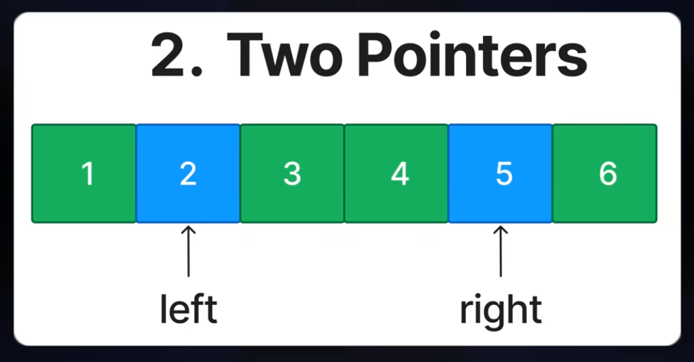

---

# [1. Two pointers youtube link](https://youtu.be/DjYZk8nrXVY?t=84)


## Directory Tree

```text
two_pointers/
|
|--> README_init.md
|--> two_pointers.png
|--> leetcode_problems/
|   |--> 125_valid_Palindrome/
```
# Two Pointers

## What is Two Pointers?

**Two pointers** is a problem-solving technique where we use two variables to track two positions in an array, string, or linked list.

These two pointers usually move through the data in a controlled way.

Example:

```text
left  -> starts from the beginning
right -> starts from the end
```

For an array:

```text
nums = [1, 2, 3, 4, 5]

left = 0
right = 4
```

So:

```text
nums[left]  = 1
nums[right] = 5
```

Then we move the pointers depending on the problem condition.

---

## Why Use Two Pointers?

---

## What is the Real-Life Use Case of Two Pointers?


